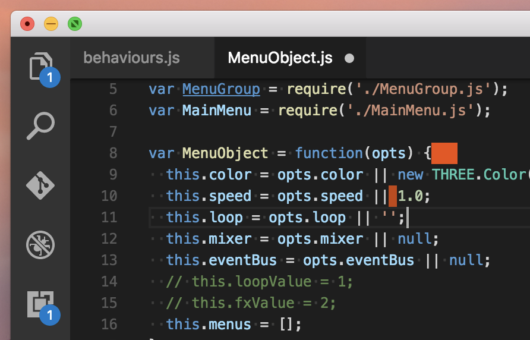

# nbsp-vscode

Highlights non breakable spaces and other similar unicode characters that might be hard to spot, also highlights trailing whitespace.

Based on [my old sublime extension](https://github.com/possan/sublime_unicode_nbsp/blob/master/sublime_unicode_nbsp.py) that does the same thing.
